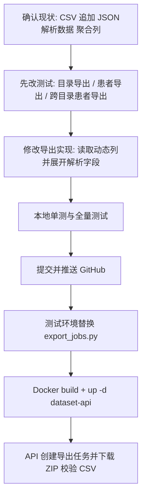

# 2026-06-10 JSON 解析字段导出 CSV 多列拆分与测试环境验证

## 背景

前一版目录导出 `merged_questionnaire.csv` 和患者导出 `patient_merged_questionnaire.csv` 已经把问卷行与 NewVision JSON 解析结果一起导出，但解析结果放在单独的 `JSON解析数据` 列中，列值是 JSON 字符串。根据最新确认，导出的 CSV 需要像界面动态列一样，把 JSON 解析字段拆成多个普通 CSV 列；目录导出和患者导出都要一致处理。

## 处理流程

## 修改文件

| 路径 | 类型 | 说明 |
| --- | --- | --- |
| `backend/app/services/export_jobs.py` | 修改 | `_merged_questionnaire_csv_bytes` 不再输出 `JSON解析数据` 聚合列；读取 `DatasetDynamicColumn`，先保留问卷列，再将解析补充字段按动态列标题展开为多个 CSV 列；没有动态列标题时回退字段 key；表头冲突时自动去重。 |
| `tests/test_export_jobs.py` | 修改 | 更新目录导出、患者导出、跨目录患者导出三组测试断言；测试 OCT_JSON 动态列标题会变成独立 CSV 表头，并确认 `JSON解析数据` 不再出现。 |
| `docs/design/数据集管理测试用例_V1.5.0_20260525.md` | 修改 | 将 TC-API-13-N03、TC-API-17-N04 从“追加 JSON 字符串列”更新为“按动态列拆成多个 CSV 列”。 |

## 关键实现

| 点 | 处理方式 |
| --- | --- |
| 问卷原始列 | 仍按 `source_type=QUESTIONNAIRE` 的动态列导出；没有动态列时回退 `raw_row_json` 的原始 key。 |
| JSON 解析补充字段 | 使用 `normalized_row_json - raw_row_json - {patientId, surveyDate, newvisionImportPayload}` 得到解析补充字段，避免重复展开问卷字段和导入元数据。 |
| 表头 | 优先使用 `DatasetDynamicColumn.column_title`，与界面列标题一致；没有注册动态列时用字段 key。 |
| 跨目录患者导出 | 取同一 PID 全部成功目录内的问卷记录，CSV 表头为解析字段并集；某次记录没有该字段则该列留空。 |
| 兼容性 | CSV 继续使用 UTF-8 BOM，方便 WPS/Excel 打开中文列名。 |

## 本地测试

| 命令 | 结果 |
| --- | --- |
| `python3 -m pytest tests/test_export_jobs.py -q` | 通过，5 个导出相关单测全部通过。 |
| `python3 -m pytest -q tests/test_dataset_mock_api.py::test_records_patient_images_and_exports tests/test_dataset_mock_api.py::test_patient_export_contains_parsed_jpeg_and_oct_json tests/test_dataset_mock_api.py::test_export_list_detail_and_download tests/test_export_jobs.py` | 通过，8 个导出/API 链路测试全部通过。 |
| `python3 -m pytest -q` | 通过，43 passed / 18 skipped。 |

## GitHub 同步

| 项 | 值 |
| --- | --- |
| 分支 | `codex-newvision-analysis-results-20260608` |
| 代码提交 | `0ac4e9a fix: split parsed export fields into csv columns` |
| 远端 | `origin/codex-newvision-analysis-results-20260608` 已推送 |

## 测试环境部署

| 项 | 值 |
| --- | --- |
| 测试环境路径 | `/opt/eye-research-dataset-backend-docker-20260525-v150` |
| 替换文件 | `backend/app/services/export_jobs.py`、`tests/test_export_jobs.py` |
| 重建命令 | `docker compose build dataset-api && docker compose up -d dataset-api` |
| 健康状态 | `eye-dataset-api` 最终为 `healthy` |

## 测试环境验证结果

使用测试环境 API 创建并下载 ZIP，检查 CSV 内容：

| 类型 | 导出任务 | 文件名 | CSV 行数 | 校验字段 |
| --- | --- | --- | --- | --- |
| 患者导出 | `exp_629a1193371848e8` | `患者数据导出-LGTA00087-20260610022819.zip` | 2 | `od Macular Avg Thickness Nine Central Subfield=230.81205235860708`；`os MacularGCC Avg Thickness Six Temporal Superior=86.5296483909416` |
| 目录导出 | `exp_f9f9b4c3ddec4bc6` | `验证0603-20260610022820.zip` | 85 | 同上两个解析字段均以独立 CSV 列存在 |

两类 CSV 均确认：

| 检查项 | 结果 |
| --- | --- |
| 是否还有 `JSON解析数据` 聚合列 | 无 |
| JSON 解析字段是否拆成多列 | 是 |
| OD/OS 目标字段值是否与数据库/界面解析值一致 | 一致 |
| ZIP 是否可下载并读取 CSV | 可以 |

## 遇到的问题与处理

| 问题 | 影响 | 处理 |
| --- | --- | --- |
| 测试机宿主 `python3` 版本较旧，不支持 `from __future__ import annotations` | 临时验证脚本首次执行失败 | 将验证脚本改成 Python 3.6 兼容写法。 |
| 真实目录 `验证0603` 导出耗时超过最初 120 秒等待窗口 | 自动脚本提前超时，但导出任务后台继续执行并最终 DONE | 查询导出任务确认完成后，改为直接校验已生成的患者/目录 ZIP。 |
| 测试机终端默认 ASCII，打印中文列名时报编码错误 | 校验已经通过但输出失败 | 用 `PYTHONIOENCODING=utf-8` 重新执行校验脚本。 |

## 最终结果

本版已完成目录导出和患者导出的 CSV 结构调整：JSON 解析结果不再作为单个 JSON 字符串列输出，而是按动态列拆成多个 CSV 列。代码已推送到 GitHub，测试环境已更新并通过真实导出 ZIP 校验。
