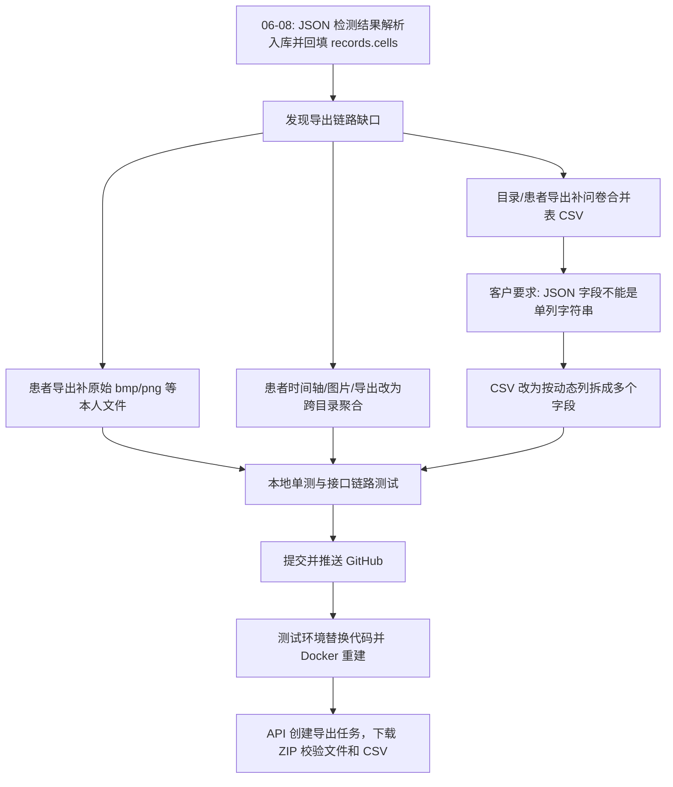

# 2026-06-10 06-08 后导出链路修复与 JSON 字段 CSV 多列验证

## 背景

2026-06-08 已完成 NewVision `*_AnalysisRlt.json` 检测结果解析、动态列注册、回填数据库以及目录导出 ZIP 中文路径乱码修复。之后围绕“导出是否严格符合需求文档”继续发现并修复了三类问题：

1. 患者个人数据导出没有完整带出本人原始目录下的 `bmp`、`png` 等原始文件。
2. 06-08 已写入数据库的 JSON 解析字段没有随导出动作以表格形式带出，后续又按客户要求从单列 JSON 字符串改为多个 CSV 字段。
3. 患者时间轴、患者图片列表、患者导出最初只按当前 `directoryId` 查，不能覆盖同一患者跨目录多次数据。

本日志补齐 06-08 之后这几块导出链路修复的过程、代码路径、测试用例、测试环境验证与最终结果。

## 修复范围总览

| 编号 | 问题 | 原因 | 修复结果 |
| --- | --- | --- | --- |
| 1 | 患者导出 ZIP 缺少本人目录下散落的 `bmp/png` 原图 | 患者导出主要依赖数据库 `DatasetImageAsset`；部分原始 `bmp/png` 未成为资产时不会被带出 | 患者导出改为从原始 `source.zip` 中按患者 ID 和日期筛选本人原始成员，写入 `images/...`；同时保留数据库资产导出 |
| 2 | JSON 解析字段没有随导出表格带出 | 06-08 只解决了解析、回填和界面展示，导出 CSV 尚未拼接解析字段 | 目录导出生成 `merged_questionnaire.csv`，患者导出生成 `patient_merged_questionnaire.csv`；保留原问卷列，追加解析补充字段 |
| 3 | 客户要求 JSON 字段不要放单个 JSON 字符串列 | 第一版 CSV 追加 `JSON解析数据` 单列，列值是 JSON 字符串，不便筛选和对照界面 | 改为按动态列拆成多个 CSV 列；不再输出 `JSON解析数据` 聚合列 |
| 4 | 患者时间轴和患者导出不能跨目录聚合同一 PID | API 路径里带 `directoryId`，原实现也按该目录过滤 | 时间轴、图片列表、图片详情、患者导出改为以 PID 聚合所有成功目录，并在结果中返回真实 `directoryId/directoryName` |
| 5 | 目录导出 ZIP 中文路径乱码 | 原 source zip 文件名编码不是 UTF-8，导出时直接使用 `zipfile` 的 cp437 解码结果 | 06-08 已修复：导出复用导入侧 `_decode_zip_member_name()` 恢复中文路径 |

## 处理流程

## 修改文件

| 路径 | 类型 | 说明 |
| --- | --- | --- |
| `backend/app/services/export_jobs.py` | 修改 | 统一目录导出和患者导出 ZIP 生成逻辑；从原始 `source.zip` 解码并筛选患者原始成员；写出 `questionnaire_rows.json`、`merged_questionnaire.csv`、`patient_merged_questionnaire.csv`；JSON 解析字段按动态列拆分为多个 CSV 字段；患者导出跨目录聚合同一 PID。 |
| `backend/app/services/directory_service.py` | 修改 | 患者时间轴、患者图片列表、图片详情按同一 PID 跨成功目录查询；返回真实 `directoryId/directoryName`，供前端展示和导出定位。 |
| `tests/test_export_jobs.py` | 修改 | 增加患者原始 `bmp/png` 文件导出、目录/患者合并 CSV、跨目录患者时间轴和患者导出、JSON 字段多列拆分等测试。 |
| `docs/design/数据集管理测试用例_V1.5.0_20260525.md` | 修改 | 补充患者跨目录导出、目录/患者导出合并表、JSON 解析字段多列拆分等验收用例描述。 |
| `docs/work-logs/2026-06-10_JSON解析字段导出CSV多列拆分与测试环境验证.md` | 新增/补充 | 本日志，记录 06-08 后导出链路修复全量过程与测试环境结果。 |

## 分项过程与产出

### 1. 患者导出补带 `bmp/png` 等本人原始文件

| 项 | 内容 |
| --- | --- |
| 问题表现 | 患者个人数据导出 ZIP 只稳定包含数据库资产，用户上传包里患者目录下散落的 `bmp/png` 原图可能缺失。 |
| 根因 | 这类文件和患者 `dat/json` 在同一原始目录下，但不是所有散落文件都会被识别成 `DatasetImageAsset`；患者导出如果只按资产表导出，就会漏掉未入资产表的原始附件。 |
| 修复 | 增加 `_iter_directory_source_members()`、`_append_patient_members_from_source()`、`_source_member_matches_patient()`，从导入时保存的 `source.zip` 逐项读取并按患者 ID、日期过滤，将本人原始成员写入 `images/...`。 |
| 日期过滤 | 如果导出传入 `surveyDates`，路径中能识别日期的文件按日期过滤；路径中没有日期但在患者目录下的文件保留，避免误删同一患者必要附件。 |
| 结果 | 患者导出既保留数据库资产导出，也补齐原始包中属于本人的未识别附件。 |

测试环境曾验证 `LGTA00087` 患者导出：ZIP 已包含 `questionnaire_rows.json`，并从原 `source.zip` 带出本人 50 个原始成员，其中 `bmp/png` 32 个，写入 `images/...`。

### 2. JSON 解析字段随目录/患者导出带出

| 项 | 内容 |
| --- | --- |
| 问题表现 | 06-08 已经把 NewVision JSON 解析字段写入数据库并在界面 records 展示，但导出动作没有把这些解析字段作为表格数据带出。 |
| 需求确认 | 目录导出需要在目录内生成合并问卷表；患者导出需要生成本人合并问卷表。如同一患者跨目录有多次问卷记录，按多行保留。 |
| 修复 | 目录导出在每个一级目录下写 `merged_questionnaire.csv`；患者导出在 ZIP 根目录写 `patient_merged_questionnaire.csv`；同时继续保留 `questionnaire_rows.json`。 |
| 字段来源 | 原始问卷列来自 `raw_row_json` 和问卷动态列；解析补充字段来自 `normalized_row_json - raw_row_json - {patientId, surveyDate, newvisionImportPayload}`。 |
| 结果 | 导出表格能同时看到原问卷字段和解析字段，且不把 `q_*`、`patientId`、`surveyDate`、`newvisionImportPayload` 重复当解析字段输出。 |

### 3. CSV 中 JSON 字段从单列字符串改为多列字段

第一版 CSV 为了快速补齐导出，追加了 `JSON解析数据` 列，列值是 JSON 字符串。客户进一步要求像界面动态列一样，每个解析字段占一个 CSV 列，因此再次调整。

| 点 | 处理方式 |
| --- | --- |
| 表头来源 | 读取 `DatasetDynamicColumn`，优先使用 `column_title`，与界面动态列一致；没有动态列时用字段 key。 |
| 表头顺序 | 先输出问卷列，再输出解析补充字段；跨目录患者导出取所有记录解析字段并集。 |
| 空值处理 | 某次记录没有某个解析字段时，该列留空。 |
| 冲突处理 | 如果解析字段标题和已有列名冲突，使用字段 key 或后缀自动去重，避免 CSV 表头覆盖。 |
| 编码 | CSV 使用 UTF-8 BOM，兼容 WPS/Excel 打开中文列名。 |
| 结果 | 不再输出 `JSON解析数据` 聚合列，OD/OS 等 JSON 解析指标作为独立列出现。 |

### 4. 患者时间轴、图片列表和导出支持跨目录

| 项 | 内容 |
| --- | --- |
| 问题表现 | 同一患者如果在多个已导入成功目录都有数据，旧逻辑只看当前 API 路径上的 `directoryId`。 |
| 需求依据 | 需求文档有患者时间轴展示，且患者数据导出应覆盖本人数据；如果同一 PID 有多次记录，需要聚合。 |
| 修复 | `patient_timeline()`、`patient_images()`、`image_detail()` 改为按 `patient_id` 查所有未删除、导入成功目录；患者导出通过 `_successful_patient_directories()` 汇总该 PID 有问卷或影像的目录。 |
| 结果 | 时间轴日期可跨目录展示；图片列表每条带真实 `directoryId/directoryName`；患者导出 ZIP 内多目录原始文件按 `images/{目录名称}/...` 分开，CSV 用 `目录ID/目录名称` 标明来源。 |

### 5. 目录导出中文路径乱码补充

06-08 已单独记录该问题，这里作为导出链路补充列入总账：

| 项 | 内容 |
| --- | --- |
| 问题表现 | 导出后 ZIP 内部中文目录名乱码。 |
| 根因 | 原 source zip 未标 UTF-8，Python `zipfile` 默认按 cp437 解码，导出时把乱码路径再次固化进新 ZIP。 |
| 修复 | 目录导出读取 source zip 时复用导入侧 `_decode_zip_member_name()`，优先恢复 GBK/GB18030 中文文件名。 |
| 结果 | 新导出 ZIP 内部中文路径恢复正常，验证样例中不存在 `╬` 等乱码字符。 |

## 本地测试

| 命令 | 结果 |
| --- | --- |
| `python3 -m pytest tests/test_export_jobs.py -q` | 通过，5 个导出相关单测全部通过，覆盖原始 `bmp/png`、合并 CSV、跨目录患者导出和 JSON 字段拆列。 |
| `python3 -m pytest -q tests/test_dataset_mock_api.py::test_records_patient_images_and_exports tests/test_dataset_mock_api.py::test_patient_export_contains_parsed_jpeg_and_oct_json tests/test_dataset_mock_api.py::test_export_list_detail_and_download tests/test_export_jobs.py` | 通过，8 个导出/API 链路测试全部通过。 |
| `python3 -m pytest -q` | 通过，43 passed / 18 skipped。 |

## GitHub 同步

| 提交 | 内容 |
| --- | --- |
| `901e5cc fix: include merged rows and raw patient files in exports` | 患者导出补带本人原始成员，目录/患者导出补 `questionnaire_rows.json` 等基础合并数据。 |
| `749812e fix: export merged questionnaire csvs across patient history` | 患者时间轴、图片、导出支持跨目录；目录/患者导出生成合并问卷 CSV。 |
| `0ac4e9a fix: split parsed export fields into csv columns` | JSON 解析字段从 `JSON解析数据` 单列字符串改为多个 CSV 动态列。 |
| `e61c5dc docs: record export csv column split validation` | 记录 CSV 拆列测试环境验证结果。 |

远端分支：`origin/codex-newvision-analysis-results-20260608`。

## 测试环境部署

| 项 | 值 |
| --- | --- |
| 测试环境路径 | `/opt/eye-research-dataset-backend-docker-20260525-v150` |
| 替换文件 | `backend/app/services/export_jobs.py`、`backend/app/services/directory_service.py`、`tests/test_export_jobs.py` |
| 重建命令 | `docker compose build dataset-api && docker compose up -d dataset-api` |
| 健康状态 | `eye-dataset-api` 最终为 `healthy` |

## 测试环境验证结果

### 患者原始文件导出

| 项 | 结果 |
| --- | --- |
| 患者 | `LGTA00087` |
| 导出任务 | `exp_4862fcc00b7340dc` |
| 文件 | `患者数据导出-LGTA00087-20260609084851.zip` |
| 验证 | ZIP 包含 `questionnaire_rows.json`；从原 `source.zip` 带出本人 50 个原始成员，其中 `bmp/png` 32 个，均进入 `images/...`。 |

### 跨目录患者导出

| 项 | 结果 |
| --- | --- |
| 合成患者 | `P_CROSS_CSV_0609` |
| 目录 A | `跨目录患者CSV验证A` / `dir_3304ee73fa3e40c5` / `2026-06-01` |
| 目录 B | `跨目录患者CSV验证B` / `dir_531d88076a0a48d2` / `2026-07-01` |
| 患者导出 | `exp_757dbacc8a184acf`，`patient_merged_questionnaire.csv` 有 2 行 |
| 结果 | 同一 PID 跨两个成功目录聚合，CSV 每行带目录上下文，原始文件按目录分组进入 `images/{目录名称}/...`。 |

### JSON 字段 CSV 多列拆分

使用真实目录 `验证0603` 通过 API 创建并下载 ZIP，检查 CSV 内容：

| 类型 | 导出任务 | 文件名 | CSV 行数 | 校验字段 |
| --- | --- | --- | --- | --- |
| 患者导出 | `exp_629a1193371848e8` | `患者数据导出-LGTA00087-20260610022819.zip` | 2 | `od Macular Avg Thickness Nine Central Subfield=230.81205235860708`；`os MacularGCC Avg Thickness Six Temporal Superior=86.5296483909416` |
| 目录导出 | `exp_f9f9b4c3ddec4bc6` | `验证0603-20260610022820.zip` | 85 | 同上两个解析字段均以独立 CSV 列存在 |

两类 CSV 均确认：

| 检查项 | 结果 |
| --- | --- |
| 是否还有 `JSON解析数据` 聚合列 | 无 |
| JSON 解析字段是否拆成多列 | 是 |
| OD/OS 目标字段值是否与数据库/界面解析值一致 | 一致 |
| ZIP 是否可下载并读取 CSV | 可以 |

## 遇到的问题与处理

| 问题 | 影响 | 处理 |
| --- | --- | --- |
| 患者原始 `bmp/png` 不一定入 `DatasetImageAsset` | 只靠资产表导出会漏掉原始文件 | 从原 `source.zip` 追加按患者/日期筛选的本人原始成员。 |
| API 路径含 `directoryId`，但需求实际要求患者维度聚合 | 同一 PID 跨目录历史数据不完整 | 保留路径兼容，内部查询改成按 PID 聚合成功目录，并在返回值/CSV 中标注真实目录。 |
| CSV 单列 JSON 字符串不便客户查看 | 客户要求像界面一样按字段展示 | 改成读取动态列并展开多列。 |
| 测试机宿主 `python3` 版本较旧，不支持 `from __future__ import annotations` | 临时验证脚本首次执行失败 | 将验证脚本改成 Python 3.6 兼容写法。 |
| 真实目录 `验证0603` 导出耗时超过最初 120 秒等待窗口 | 自动脚本提前超时，但导出任务后台继续执行并最终 DONE | 查询导出任务确认完成后，改为直接校验已生成的患者/目录 ZIP。 |
| 测试机终端默认 ASCII，打印中文列名时报编码错误 | 校验已经通过但输出失败 | 用 `PYTHONIOENCODING=utf-8` 重新执行校验脚本。 |

## 最终结果

06-08 后续导出链路修复已完成：

1. 患者个人数据导出会带出本人原始目录下的 `bmp/png` 等原始文件。
2. 目录导出和患者导出都会生成合并问卷 CSV，并带出已解析的 JSON 检测结果字段。
3. JSON 检测结果字段已按动态列拆成多个 CSV 列，不再塞到单个 `JSON解析数据` 字符串列。
4. 患者时间轴、图片列表、图片详情和患者导出已按同一 PID 跨成功目录聚合。
5. 相关代码已推送 GitHub，测试环境已更新并通过本地单测、接口链路测试和真实 ZIP 下载校验。
